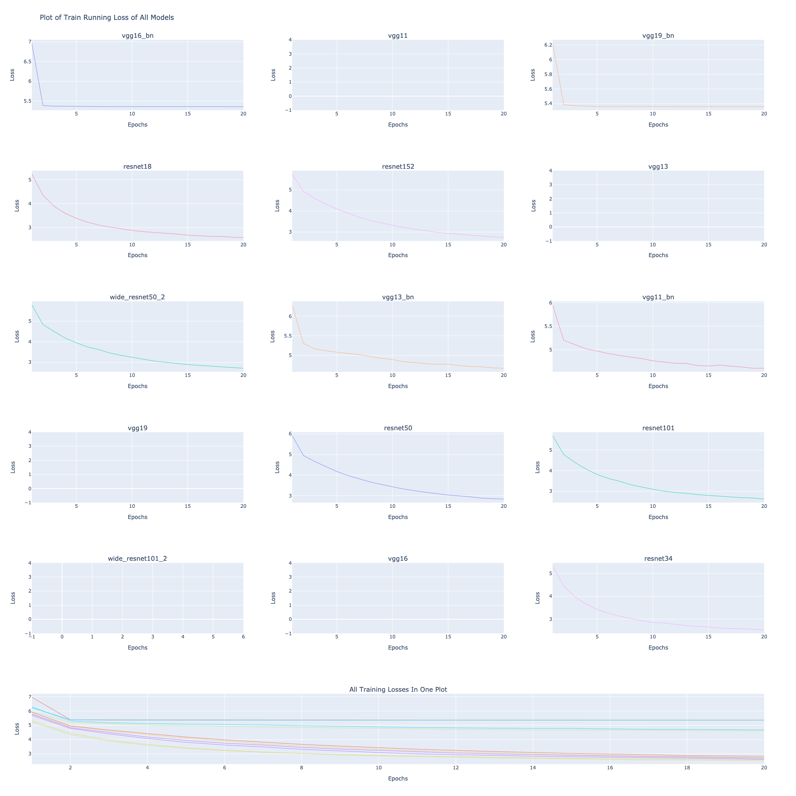
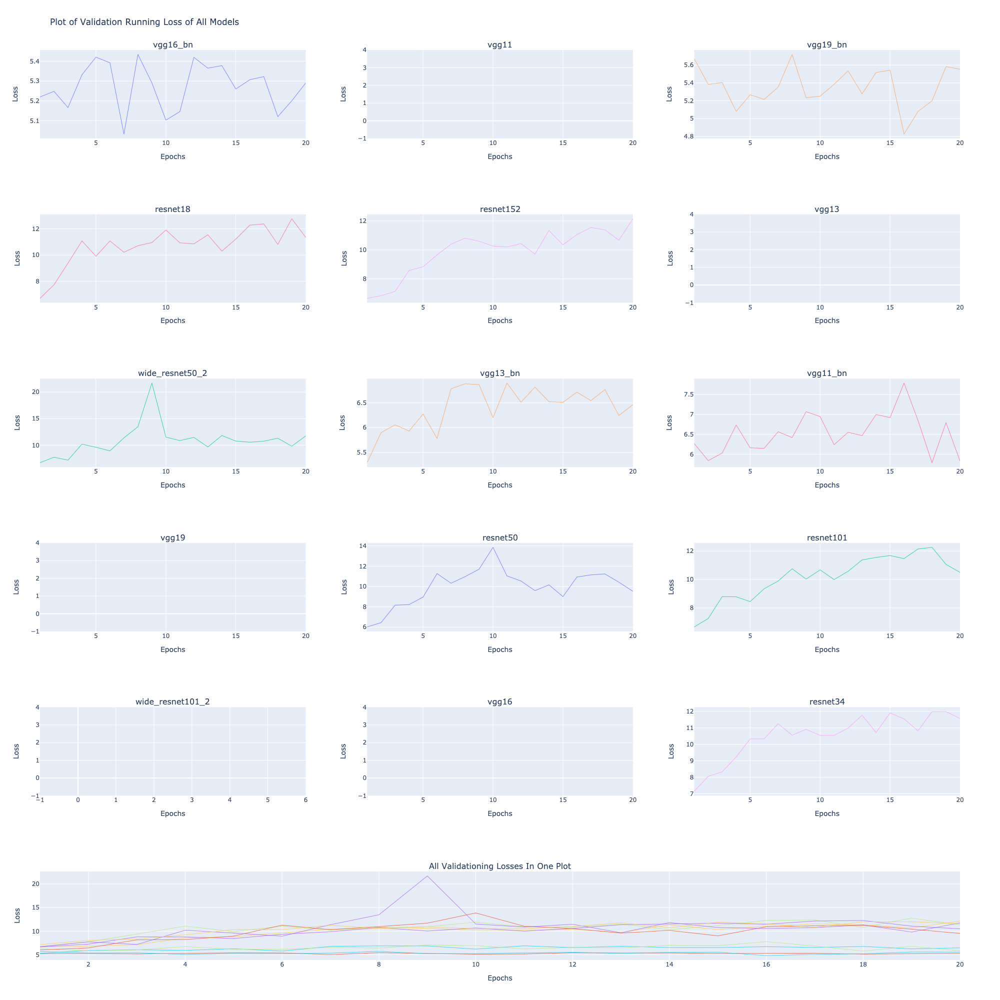

# Parallelizing ImageNet Training with Metaflow 

Repository contains code to parallise training of Imagenet using Metaflow with Kubernetes GPU Support. To train ImageNet Pytorch's example code NN are directly used here. 

## Metaflow On Kubernetes Setup

- Instructions of Setup of Kubernetes GPU based cluster for Metaflow :
    - https://github.com/valayDave/metaflow-on-kubernetes-docs

- Using `@kube(cpu=4,memory=40000,gpu=4,image='anibali/pytorch:cuda-10.1')` will enable GPU based training on cluster.  

- This code works for CPU and GPU setups. GPU jobs can fail If GPU Memory is not enough. This can be solved by increasing number of GPUS in decorator vs Decreasing Batchsize.Specially noticed with Resnet when Running this same flow with only 2 GPUs. 

- Download Dataset From https://tiny-imagenet.herokuapp.com/

- S3 Required for Parallelised GPU training on AWS. 

- Service based metadata provider required with 

- Models Trained from script : 
    - resnet101
    - resnet152
    - resnet34
    - resnet18
    - resnet50
    - vgg11
    - vgg11_bn
    - vgg13
    - vgg13_bn
    - vgg16
    - vgg16_bn
    - vgg19
    - vgg19_bn
    - wide_resnet101_2
    - wide_resnet50_2

## Running Instructions
1. Upload dataset to S3 and change parameter `dataset_s3_path` in the `imagenet_metaflow.py` or add it into your run parameters. 
2. To Run on Local, Comment out `@kube` decorator and use the below command: 
    ```
    python imagenet_metaflow.py --metadata local run --max-workers 2 
    ```
3. To Directly deploy the runtime to on Kubernetes cluster provide a service based metadata. Set Max workers in command on basis of available GPUS. Direct deploy command : 
    ```
    python imagenet_metaflow.py kube-deploy run --max-workers 2 --dont-exit
    ```
4. Analytics Can be see in `analytics.ipynb`. Some models are yielding `nan` as loss output so they are not plotted in the results. 

5. If deploying a cluster, Ensure beefy kubernetes master instances because runtime keeps polling kubernetes. 

## Training Specs 
- Training Specs : 
    - 2 p2.8xlarge GPU Instances. 
    - 20 Epochs per Model
    - 24 Hours of training
    - Hyper Params in [imagenet_metaflow.py](imagenet_metaflow.py)
## Results



## TODO 
- [x] Create Notebook to Show Results. 
- [x] Document the Models that are trained using this script.
- [x] Run Model training in Parallel for 10 models Over More than 20 Epochs.
